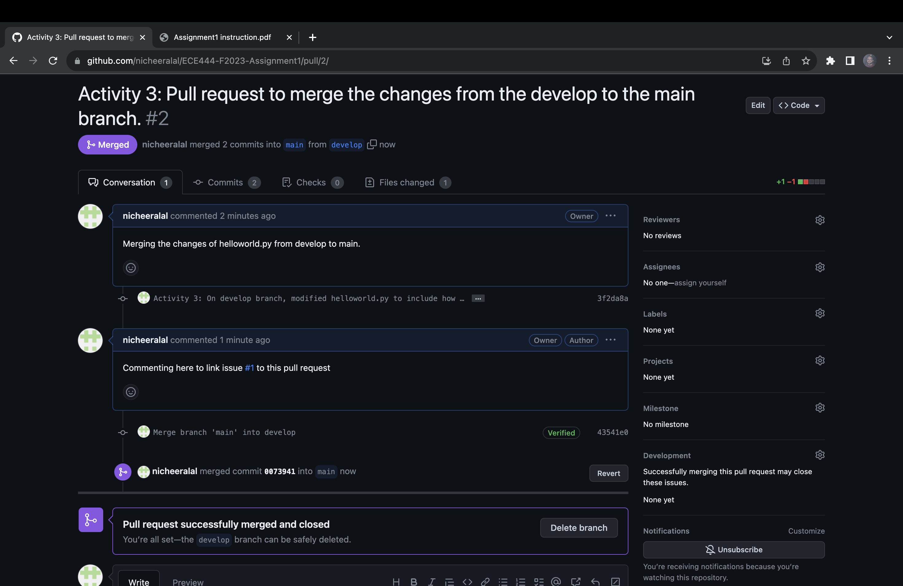
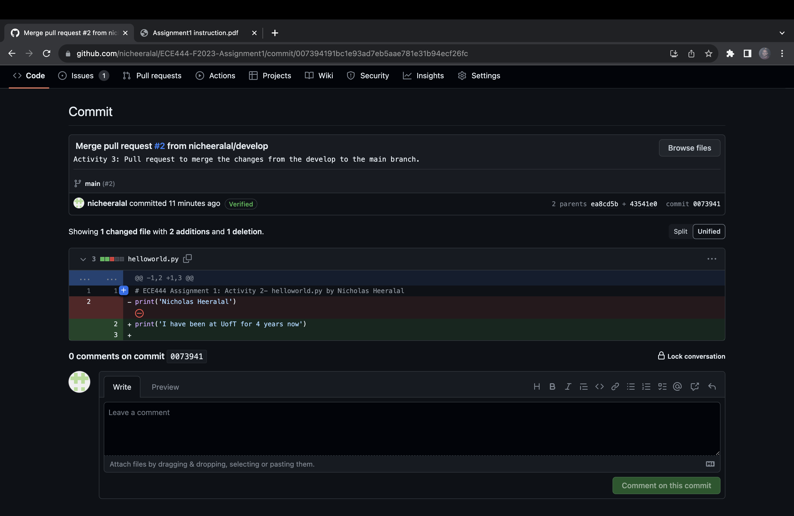
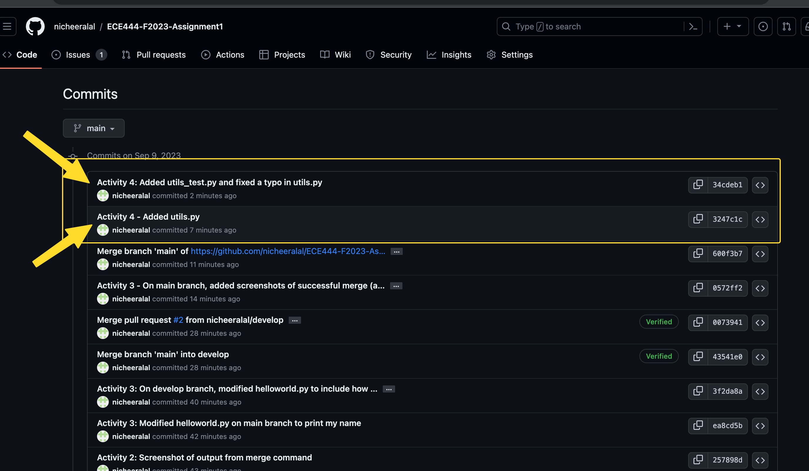
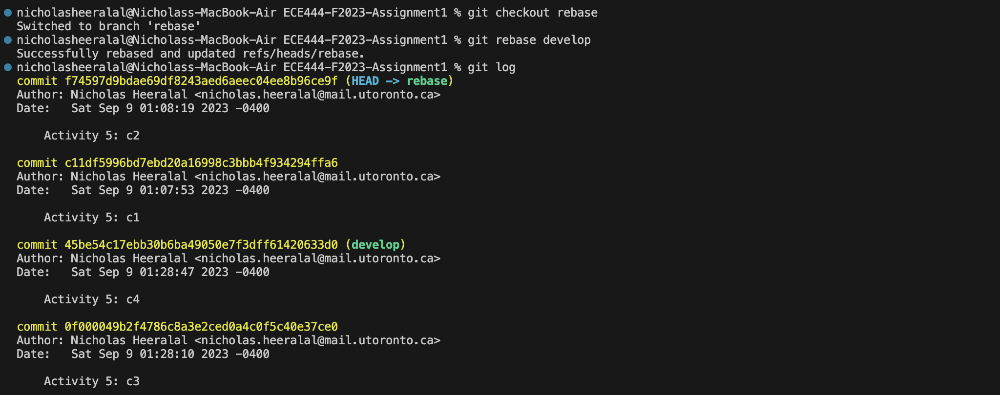
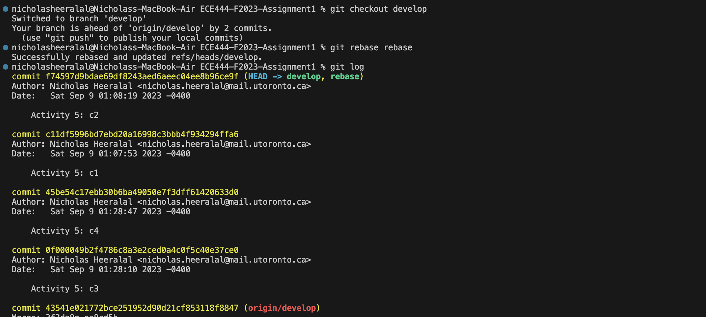

Nicholas Heeralal

Screenshot of First Commit from Activity #1

Screenshot for the output of the merge command on the “main” branch from Activity #2

Screenshots for successful merge (after merge conflict) from Activity 3 

Screenshot for the commits into README file on the main branch for Activity 4

Screenshot for a few of the commands (along with their outputs) you used for rebase for Activity 5

git rebase develop (on "rebase" branch) 
This was done to get c3->c4->c1->c2 on rebase branch first

git rebase rebase (on "develop" branch)
This was done to get c3->c4->c1->c2 on the develop branch

Screenshot of some bash terminal history of commands in this git rebase activity

